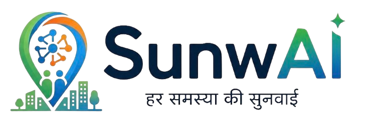

<div align="center">
  
  
  # SunwAI — Har Samasya Ki Sunwai
  
  **AI-Powered Hyperlocal Civic Issue Reporting Platform for Indian Cities**
  
  [](https://sunwai-cee55.web.app)
  [](https://firebase.google.com)
  [](https://react.dev)
  [](https://ai.google.dev)

  *Built for **Vibe2Ship Hackathon** | Coding Ninjas × Google for Developers | June 2026*
</div>

---
## Live URL : https://sunwai-cee55.web.app


## 🔐 Test Credentials

| Role | Email | Password |
|------|-------|----------|
| 🏛️ Ward Officer | ward@sunwai.com | 123456 |
| 🏢 Municipal Corporation | municipalco@sunwai.com | 123456 |
| 🏗️ Department Officer | departmentofficer@sunwai.com | 123456 |
| 👤 Citizen | Register with email or Google Sign-In | — |

---

## 🚀 What is SunwAI?

SunwAI (*"Har Samasya Ki Sunwai"* — Every Problem Gets Heard) is a full-stack civic tech platform that bridges the gap between Indian citizens and municipal authorities. Citizens report civic issues in **Hindi, English, or Hinglish** — by typing, speaking, or uploading a photo/video. AI classifies the issue and routes it through a complete multi-role resolution workflow.

---

## ✨ Key Features

### 🤖 AI-Powered Conversational Reporting
- Multilingual chatbot powered by **Google Gemma 4 31B** via NVIDIA NIM
- State-machine: greets → gathers → drafts report → confirms → submits
- Voice input & output (Web Speech API) for accessibility
- Works in Hindi, English, Hinglish — "kachra gadi nhi aa rhi" → full structured report

### 📷 AI Vision Analysis
- Upload photo or video → **Google Gemma 3N E2B** auto-detects issue type, severity, department
- Video support: extracts keyframe at 25% duration
- Camera capture OR gallery selection on mobile

### 🔥 Mega Complaint System
- Haversine formula detects reports within **10-metre radius** with same category
- Auto-merges into Mega Complaint — escalates priority & severity
- "🔥 Mega Complaint ban gayi! 3 logon ne ek hi jagah ki samasya report ki hai"

### 👥 Multi-Role Resolution Workflow
- **Citizen** → Report, track, verify nearby issues, earn badges
- **Ward Officer** → Priority queue, status updates, escalate to Corp
- **Department Officer** → Department-filtered view, resolve issues
- **Municipal Corporation** → Full oversight, force resolve, AI PDF reports

### 🗺️ Real-Time Heatmap
- Custom Canvas `OverlayView` — no deprecated HeatmapLayer
- Additive blending for smooth density visualization
- Radius scales with zoom (Web Mercator formula)
- Green → Yellow → Orange → Red palette

### 🎮 Gamification
- Points: +10 report, +5 verify
- Badges: First Reporter, Mega Reporter, Ward Champion, Verified Citizen
- Daily missions, leaderboard, level progression
- Levels: Naya Nagarik → Ward Champion

### 📄 AI PDF Reports
- Authority accounts download full PDF reports
- Logo, AI executive summary, stat boxes, category & status breakdown
- Generated by **Google Gemma 3N E4B** via NVIDIA NIM

### ✅ Citizen Verification
- Verify nearby issues reported by others
- Adds credibility, awards points

---

## 🛠️ Tech Stack

| Layer | Technology |
|-------|-----------|
| Frontend | React 19, Vite 8, TypeScript 6, TailwindCSS 4 |
| State | Zustand |
| Routing | React Router DOM v6 |
| Backend | Firebase Cloud Functions (Node.js 22, 2nd Gen) |
| Database | Firebase Firestore |
| Auth | Firebase Authentication (Google + Email) |
| Hosting | Firebase Hosting |
| AI Chat | Google Gemma 4 31B IT — NVIDIA NIM |
| AI Vision | Google Gemma 3N E2B IT — NVIDIA NIM |
| AI Report | Google Gemma 3N E4B IT — NVIDIA NIM |
| Maps | Google Maps JS API + Geocoding API |
| PDF | jsPDF + jspdf-autotable |
| Voice | Web Speech API |

---

## 🔧 Setup & Run Locally

```bash
# 1. Clone
git clone https://github.com/T-Skrgyn/SunwAI.git
cd SunwAI

# 2. Install dependencies
npm install

# 3. Create .env file
cp .env.example .env
# Fill in your Firebase and API keys

# 4. Run dev server
npm run dev

# 5. Functions (separate terminal)
cd functions
npm install
firebase emulators:start --only functions
```

### Environment Variables

```env
VITE_FIREBASE_API_KEY=
VITE_FIREBASE_AUTH_DOMAIN=
VITE_FIREBASE_PROJECT_ID=
VITE_FIREBASE_STORAGE_BUCKET=
VITE_FIREBASE_MESSAGING_SENDER_ID=
VITE_FIREBASE_APP_ID=
VITE_GOOGLE_MAPS_KEY=
VITE_NVIDIA_API_KEY=
VITE_USE_EMULATOR=false
```

---

## 🏗️ Project Structure

```
SunwAI/
├── public/
│   └── logo.png
├── src/
│   ├── components/
│   │   ├── chat/ChatBot.tsx        # AI chatbot + mega complaint
│   │   └── map/HeatMap.tsx         # Canvas heatmap overlay
│   ├── pages/
│   │   ├── citizen/                # Dashboard, ReportIssue, MyIssues
│   │   ├── ward/                   # Ward Officer dashboard
│   │   ├── dept/                   # Department Officer dashboard
│   │   ├── corp/                   # Municipal Corporation dashboard
│   │   └── auth/                   # Login, RoleSelect
│   ├── lib/
│   │   ├── gemini.ts               # NVIDIA NIM API client
│   │   ├── firebase.ts             # Firebase config
│   │   ├── gamification.ts         # Points, badges, missions
│   │   └── generateReport.ts       # AI PDF report generator
│   ├── store/authStore.ts          # Zustand auth store
│   └── types/index.ts              # TypeScript interfaces
├── functions/
│   └── index.js                    # Firebase Cloud Functions
└── .env.example
```

---

## 🌐 Google Technologies Used

| Technology | Usage |
|-----------|-------|
| Google Maps JS API | Heatmap, markers, geocoding |
| Google Gemma 4 31B | Multilingual civic chatbot |
| Google Gemma 3N E2B | Photo/video issue classification |
| Google Gemma 3N E4B | AI PDF report generation |
| Firebase Auth | Google Sign-In + Email/Password |
| Firebase Firestore | Real-time issue database |
| Firebase Cloud Functions | Serverless NVIDIA API proxy |
| Firebase Hosting | PWA deployment |
| Google Geocoding API | GPS → Indian address |

---

<div align="center">
  <strong>SunwAI — Har Samasya Ki Sunwai</strong><br/>
  Vibe2Ship Hackathon 2026
</div>
